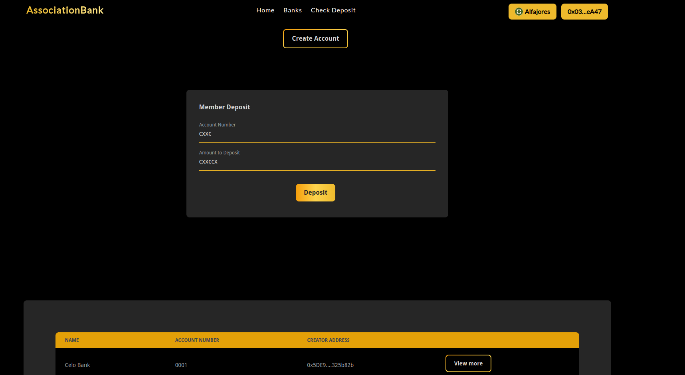
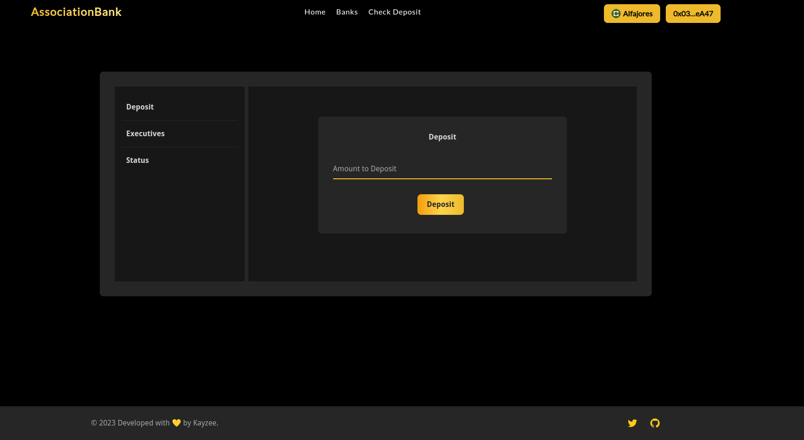

# About the project 

## Association bank
Association bank is an association based bank where members of association can deposit into association banks and only excutive members can withdraw, the withdrawal of any executive member can  only be possible with the approval of other executive members (similar to multisig wallet).

The genesis of each account start from creating an account with the "create account" button in the home page
    - The password must contain at least one lowercase, uppercase, number and 8 characters long
    - The create account has a button "add address" to add multiple exco address before submitting the form
    - The executive address input only accept ethereum address

## Home page

* The home page consist of input form to deposit into any association account and list of account created on the platform
* The list contains name, account number of the association and the association creator address.
* Every associaiton dashboard can be assesed by clicking on the view more button
* Clicking on the "view more" button of an associaiton will direct you to interacting and viewing various activities done by the associaiton.

## Association dashboard

The dashboard is the point of interacting and viewing various activities done by an association

* User can deposit into the association account by using the deposit tag
* Executive can control their portion of the account by accessing the executive page
* The executive page consist of four internal tabs which are: initiate withdrawal, approve withdrawal, revert withdrawal, withdraw.
    - Initiate withdrawal is used when any executive member wants to withdraw from the association (This is the starting point of withdrawal)
    - By initiating a withdrawal, withdrawal order is being returned which can be used for approval and final withdrawal.
    - For the withdrawal to be successful, other executive member must approve the withdrawal using the "approve withdrawal" tab.
    - In case any executive member changed his/her mind, he/she can revert his/her approval.
    - After successful approval by other executive member, the withdrawal initiator can therefore withdraw fully.
* The status tab in the dashboard is available for any member to check the status of any transaction in the association for transparency
* Member of an association can view association balance by using the association password
